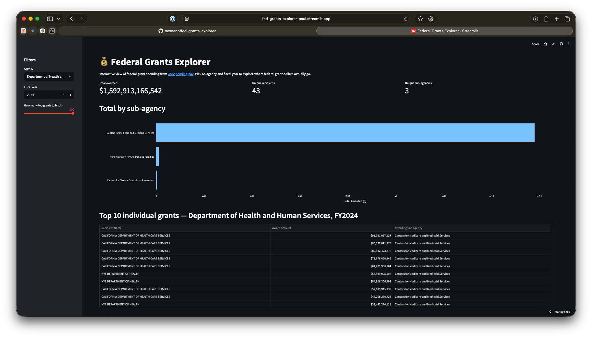
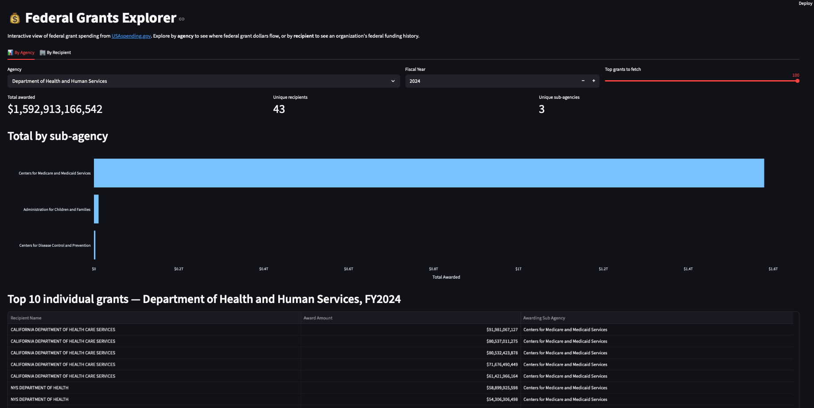

# Federal Grants Explorer

> 🚀 **Live demo:** [fed-grants-explorer-paul.streamlit.app](https://fed-grants-explorer-paul.streamlit.app)

A focused dashboard for exploring federal grant data — built for grants teams, program officers, and analysts who want to ask specific questions without navigating USAspending's full query interface.



## Why this project

[USAspending.gov](https://www.usaspending.gov/) is the canonical source for U.S. federal spending data, but it's built for power users running broad queries. Nonprofit grants teams, federal program officers, and grants consultants often want to answer narrower questions — *"where does this agency's grant money actually flow?"* or *"what does this recipient's federal funding history look like?"* — without wading through a complex multi-screen query interface.

Drawing on my experience in federal grants management at the U.S. Department of Health and Human Services, this project puts focused, audience-specific views on top of USAspending's data. It's not trying to replace USAspending — it's trying to be the right tool when you have a specific question.

## What it does

The dashboard answers two questions:

**📊 By Agency:** *"For agency X in fiscal year Y, where does the grant money go?"* Pick any federal agency and fiscal year to see total awarded, the largest individual grants, and the breakdown across sub-agencies.

**🏢 By Recipient:** *"What is this organization's federal funding history?"* Enter a recipient name (full or partial) and a range of fiscal years to see total funding, the breakdown across awarding agencies, and the full list of individual grants. Fuzzy matching means `University of California` catches every UC campus; `American Red Cross` catches all their federal lines.



Both views share the same data-cleaning layer — including a function that auto-detects and flips USAspending's quirky inverted naming format (e.g., `HEALTH CARE SERVICES, CALIFORNIA DEPARTMENT OF` → `CALIFORNIA DEPARTMENT OF HEALTH CARE SERVICES`).

Built entirely on free public APIs — no authentication, no API keys, no costs.

## Tech stack

- **Python 3.12** with [`uv`](https://docs.astral.sh/uv/) for dependency management
- [`requests`](https://docs.python-requests.org/) with retries and exponential backoff for resilient HTTP calls to the USAspending API
- [`pandas`](https://pandas.pydata.org/) for tabular data handling
- [`streamlit`](https://streamlit.io/) for the interactive dashboard
- [`plotly`](https://plotly.com/python/) for charts
- Deployed on [Streamlit Community Cloud](https://streamlit.io/cloud)

## Getting started

Prerequisites: Python 3.12+, [uv](https://docs.astral.sh/uv/), Git.

```bash
git clone https://github.com/taxmanp/fed-grants-explorer.git
cd fed-grants-explorer
uv sync

# Run the command-line version:
uv run python main.py

# Or launch the dashboard locally:
uv run streamlit run app.py
```

## Roadmap

- [x] Fetch federal grant data from USAspending API
- [x] Clean up USAspending's inverted recipient name format
- [x] Format dollar amounts as readable currency
- [x] Sub-agency breakdown using pandas groupby
- [x] Interactive Streamlit dashboard with sidebar filters
- [x] Deploy to Streamlit Community Cloud
- [x] Resilient HTTP layer with retries + graceful error handling
- [x] **Recipient lookup**: see all federal awards for a single recipient across agencies and years
- [ ] **Auto-surfaced insights**: detect funding concentration patterns and explain them in plain English *(next up)*
- [ ] **Multi-year time series**: track an agency's grant trajectory across fiscal years
- [ ] **State + congressional district views**: geographic breakdowns with map visualization
- [ ] **CFDA / Assistance Listing program breakdowns**
- [ ] Unit tests for the data-cleaning functions

## Background reading

- [USAspending API documentation](https://api.usaspending.gov/)
- [2 CFR Part 200](https://www.ecfr.gov/current/title-2/subtitle-A/chapter-II/part-200) — Uniform Guidance for federal grants
- [DATA Act of 2014](https://en.wikipedia.org/wiki/Federal_Funding_Accountability_and_Transparency_Act) — the law that makes this data public

## About the author

Built by Paul Rodriguez — finance and analytics professional with a background in federal grants management, Big Four tax, and international finance consulting. [LinkedIn](https://www.linkedin.com/in/paulrodriguez5/) · [GitHub](https://github.com/taxmanp)